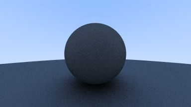
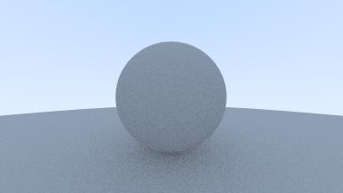

# rust-ray-tracing-demo

The rust implementation of [Ray Tracing in One Weekend](https://raytracing.github.io/books/RayTracingInOneWeekend.html)

## How to run？

```shell
cargo run {number}
```

For example, Run `cargo run 0` to generate `dist/00.ppm`(you can download `.ppm` viewer to view the images).

**\*cargo run \*\*** to run all demos.

## Images

### demo0 & demo1


### demo2


### demo3


### demo4


### demo5


### demo6


### demo7



### demo8



### demo9


